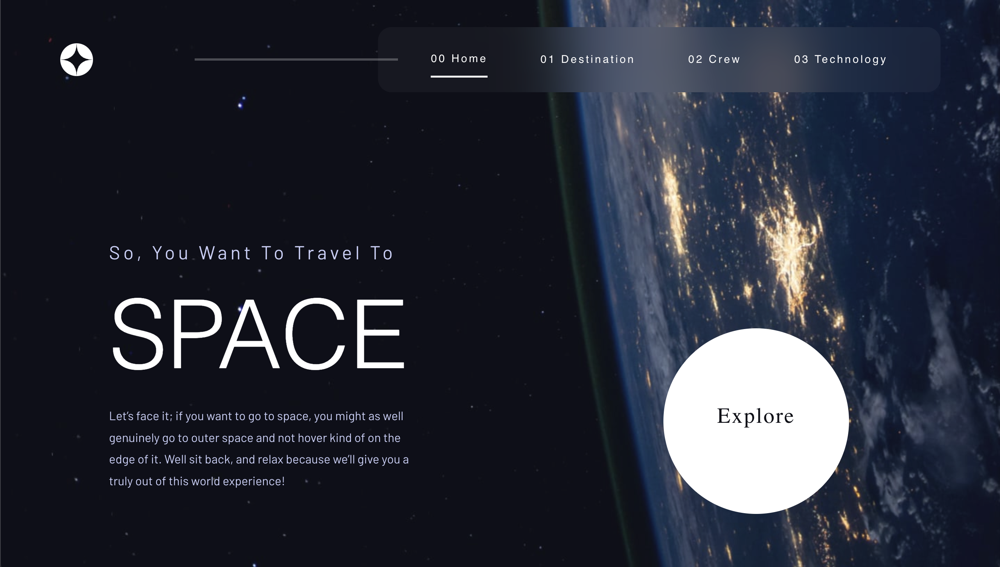
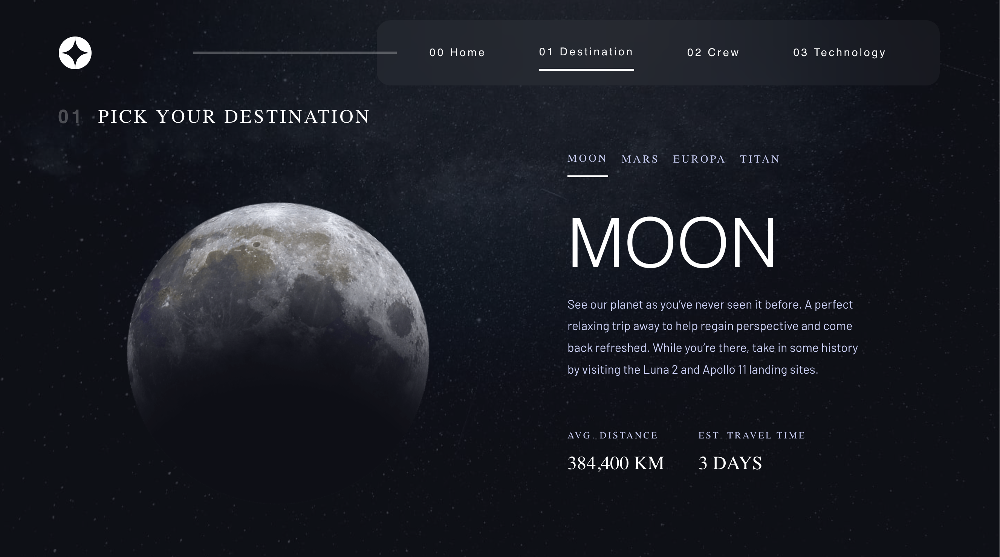
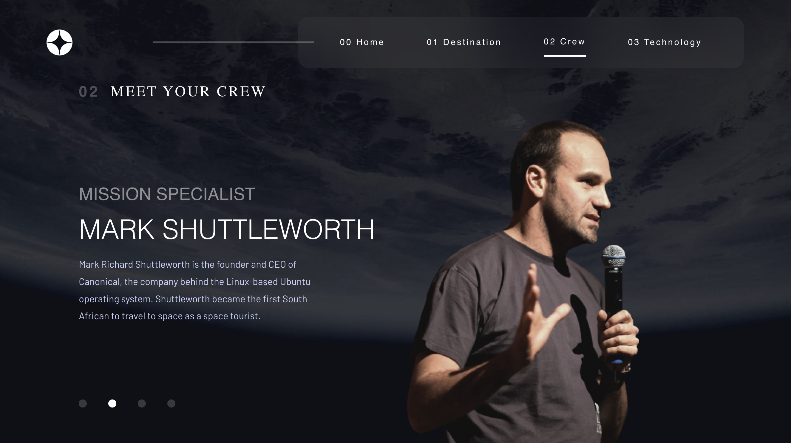
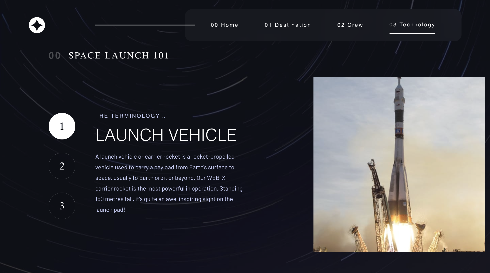
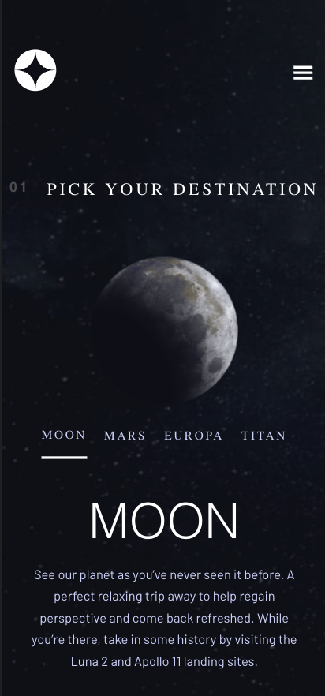
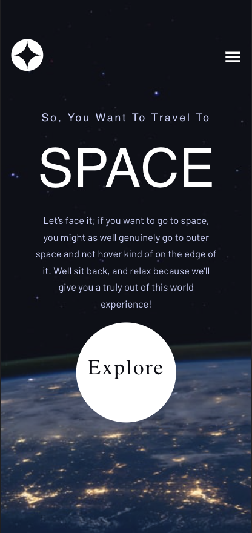
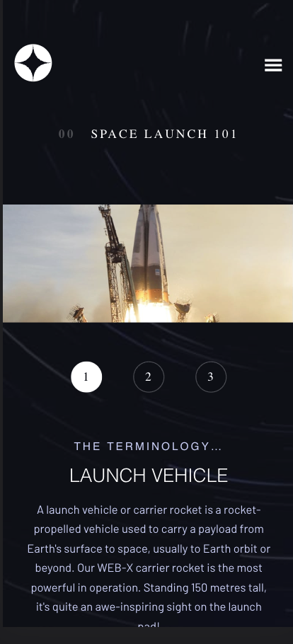

# Space Tourism Multipage Website

This is a solution for the [Space Tourism Multipage Website challenge](https://www.frontendmentor.io/challenges/space-tourism-multipage-website-gRWj1URZ3) on Frontend Mentor. It is a React-based project that incorporates Framer Motion for animations and transitions.

## Table of Contents

- [Overview](#overview)
    - [Links](#links)
    - [Screenshot](#screenshot)
- [Built With](#built-with)
- [Features](#features)
- [Contact](#contact)
- [Acknowledgements](#acknowledgements)

## Overview

The Space Tourism Multipage Website project is a frontend challenge that involves creating a website to showcase space tourism destinations. It utilizes React for component-based development and incorporates Framer Motion to bring animations and transitions to life.

### Links

- [Live Demo](https://vaqueraoscar0.github.io/FrontendMentorio-Space-Tourism)
- [Frontend Mentor Solution Page](https://www.frontendmentor.io/solutions/space-tourism-multipage-website-react-framer-motion-xyz123)

### Screenshot

## Built With

This project was built using the following technologies:

- React
- Framer Motion
- HTML5
- CSS3

## Features

This project includes the following features:

- Multi-page layout with smooth transitions
- Responsive design for optimal viewing on different devices
- Interactive elements and animations to enhance user experience
- Seamless navigation between pages

## Contact

If you have any questions, feedback, or would like to connect, please feel free to reach out. You can contact me at vaqueraoscar0@gmail.com.

## Acknowledgements

I would like to express my gratitude to Frontend Mentor for providing this challenge and the opportunity to enhance my frontend development skills. Additionally, I want to thank the creators and contributors of React and Framer Motion for developing these powerful libraries.
